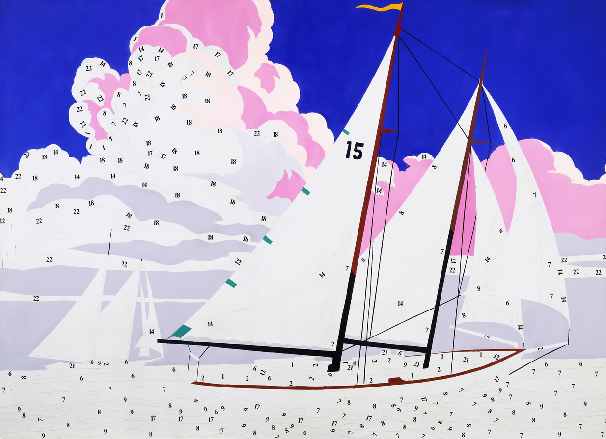

# paint-by-numbers
Impressionist GAN in PyTorch

## Introduction

Much of Andy Warhol's work had to do with the industrialization and commercialization of art. He was obsessed with the repetition in art, evident in [Cambell's Soup Cans](https://en.wikipedia.org/wiki/Campbell%27s_Soup_Cans) and the mechanization of his work via [silkscreening](https://en.wikipedia.org/wiki/Screen_printing). In an interview in 1963, Warhol was asked why he painted the same image over and over, he responsed "The reason I'm painting this way is that **I want to be a machine.**"

Some of my favorite paintings is a lesser-known series by Warhol, titled *Do It Yourself*. In particular I really enjoy *Do It Yourself (Sailboat)* (depited above). This series of painting was a critique (or perhaps in reverence of) [paint by numbers kits](https://en.wikipedia.org/wiki/Paint_by_number), which were sold so that people could make art at home. While the concept of paint by numbers ties into the commodification of art as a whole, it also brings up questions of orginiality and creativity. What is art if it's as simple as painting by numbers?

Generative Adverserial Networks (GANs) take a vector of random numbers as input, and output whatever they were trained to produce. In this repository, I will be training them to create impressionist paintings - to paint by numbers.
