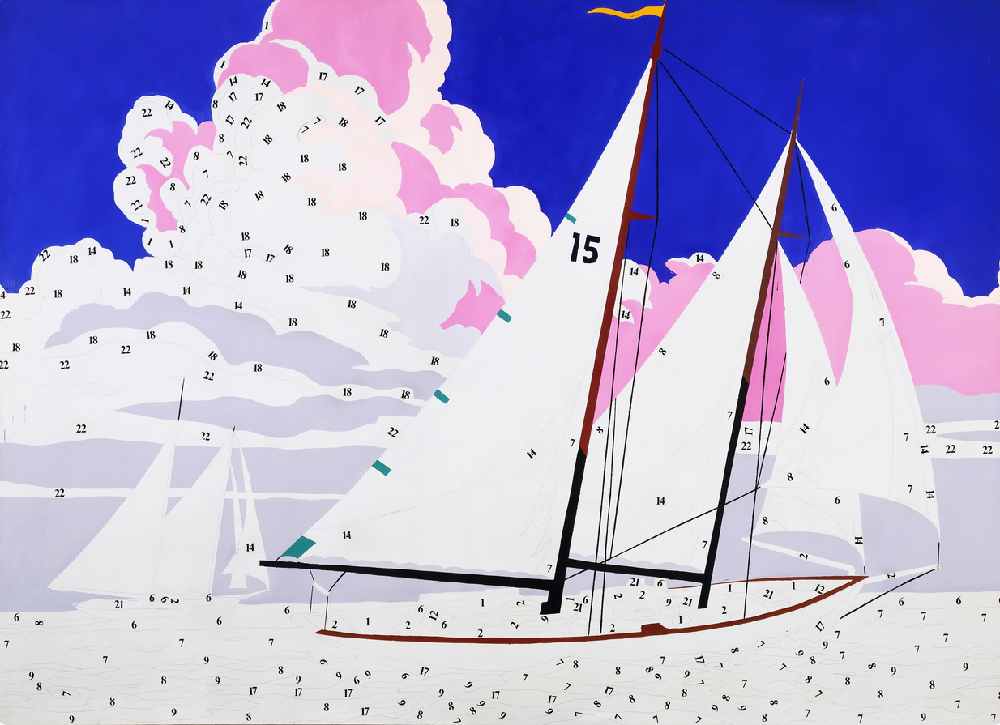
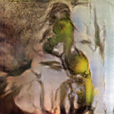
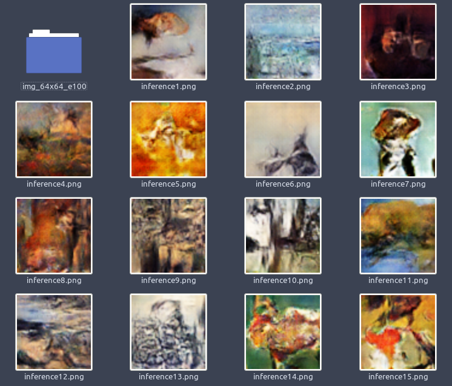

# paint-by-numbers
Impressionist GAN in PyTorch

## Introduction

Much of Andy Warhol's work had to do with the industrialization and commercialization of art. He was obsessed with the repetition in art, evident in [Cambell's Soup Cans](https://en.wikipedia.org/wiki/Campbell%27s_Soup_Cans) and the mechanization of his work via [silkscreening](https://en.wikipedia.org/wiki/Screen_printing). In an interview in 1963, Warhol was asked why he painted the same image over and over, he responsed "The reason I'm painting this way is that **I want to be a machine.**"

Some of my favorite paintings is a lesser-known series by Warhol, titled *Do It Yourself*. In particular I really enjoy *Do It Yourself (Sailboat)* (depited above). This series of painting was a critique (or perhaps in reverence of) [paint by numbers kits](https://en.wikipedia.org/wiki/Paint_by_number), which were sold so that people could make art at home. While the concept of paint by numbers ties into the commodification of art as a whole, it also brings up questions of orginiality and creativity. What is art if it's as simple as painting by numbers?

Generative Adverserial Networks (GANs) take a vector of random numbers as input, and output whatever they were trained to produce. In this repository, I will be training them to create impressionist paintings - to paint by numbers.

## Test 1 (64x64 images, 100 epochs)

As a first test, I wanted to get something running fairly fast, so I chose small images, a latent vector twice the size of the image (128 random numbers), and just 100 epochs. The results are somewhat okay. Ideally, I want higher resolution, and training to maybe 300 epochs. This was the random vector I was tracking progress on as the network trained to see how a static input evolves over time:

And here is a few more samples:

This model took about 1.5 hours to train on a NVIDIA MX350.

## Test 2 (128x128 images, 200 epochs)

I doubled the width and height of the images and trained for twice the length. I think that the model could go to 250 or 300 epochs ideally. The target resolution is 1024x1024, but to do this, we need to train on a cloud compute platform. 

Crucially, I also adjusted the learning rate of the generator to be much faster than the descriminator. This seems to strike a good balance between the two, though I noticed towards the end of the 200 epochs, the generator began to do worse at fooling the discriminator.

Here are some samples from this run. I think they are much better than test 1, but there is still a ways to go.

This model took about 14.7 hours to train on a NVIDIA MX350.
