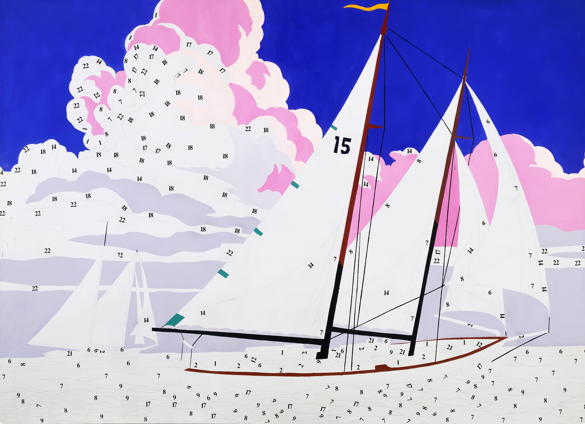

# paint-by-numbers
Impressionist painting flow matching in PyTorch

## Introduction

Much of Andy Warhol's work had to do with the industrialization and commercialization of art. He was obsessed with the repetition in art, evident in [Cambell's Soup Cans](https://en.wikipedia.org/wiki/Campbell%27s_Soup_Cans) and the mechanization of his work via [silkscreening](https://en.wikipedia.org/wiki/Screen_printing). In an interview in 1963, Warhol was asked why he painted the same image over and over, he responsed "The reason I'm painting this way is that **I want to be a machine.**"



Some of my favorite paintings is a lesser-known series by Warhol, titled *Do It Yourself*. In particular I really enjoy *Do It Yourself (Sailboat)* (depited above). This series of painting was a critique (or perhaps in reverence of) [paint by numbers kits](https://en.wikipedia.org/wiki/Paint_by_number), which were sold so that people could make art at home. While the concept of paint by numbers ties into the commodification of art as a whole, it also brings up questions of orginiality and creativity. What is art if it's as simple as painting by numbers?

Flow Matching neural networks take a vector of random numbers as input, and output whatever they were trained to produce. In this repository, I will be training them to create impressionist paintings - to paint by numbers.

### Strategy

First pre-train the model on imagenet, then focus on impressionist paintings. There aren't many paintings (under 10k), so we don't really have a sufficient dataset to work with. However, using imagenet should get the model to learn the general form of images before focusing on stylistic fine-tuning.

## Data

Data was pulled from [kaggle](https://www.kaggle.com/c/imagenet-object-localization-challenge/overview/description). This is just a subset of imagenet, but it does contain about 1.4 million images, which is enough for pre-training. Note that the images are in a nested structure for class conditional generation. I am interested in unconditional class generation, so I flattened this structure out before running the image resizer script (which does not recursively go into the `train` `test` and `val` folders).

Next we want to resample the images to the right size. Within the directory structure of that data, we only care about `ILSCRC/Data/CLS-LOC/` which I have extracted to a folder called `imagenet`.

The size I am targeting is 512. 

```bash
uv run scripts/image_resizer_imagent.py -i ./data/imagenet/ -o ./data/imagenet512/ -s 512 -a box -r -j 10
```

## Acknowledgment and licenses

* The code for this repo was initially based off of the [flow matching repo from facebook research](https://github.com/facebookresearch/flow_matching). Both Meta's project and this one are licensed under CC BY-NC 4.0 This code may only be used for noncommercial purposes and requires attribution of both Meta Inc. and Noah Schiro.
* Patryk Chrabaszcz wrote the image preprocessing script and I made some modifications. Go check out his [repo](https://github.com/PatrykChrabaszcz/Imagenet32_Scripts). This code falls under MIT. See the header in `/image_resizer_imagent.py` for more information.
